# Combat readability audit — 2026-09-08

Release follow-up: included in v2.9.4 by subsequent user authorization. Original local-stage status below is historical.

Scope: current Royal Garden battlefield, mobile unit/enemy distinction, effects, selection and global upgrade access. No balance, art replacement, map resizing, version change or deployment.

## Observed flow (390×844)

1. Enemy roster — healthy in the sampled still: five enemy silhouettes/colors distinguishable on pale path. Small sprites are an accessibility risk at narrow widths, but this sample does not justify enlarging them.
   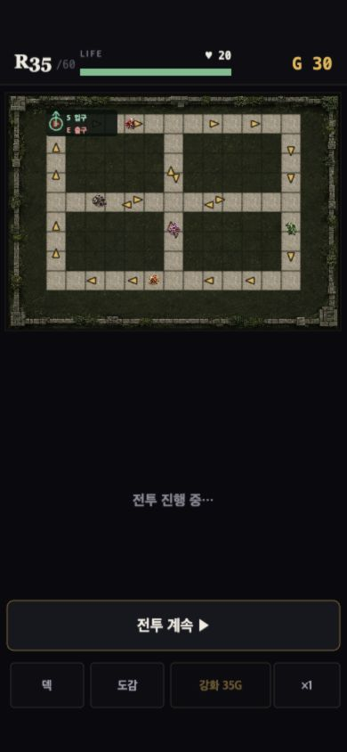
2. Dense R40 combat — 26 allied units and 26 enemies including a boss, generated only by a localhost fixture at legal integer placement/path coordinates. Board and boss HP remain separated; no clear need to replace art.
   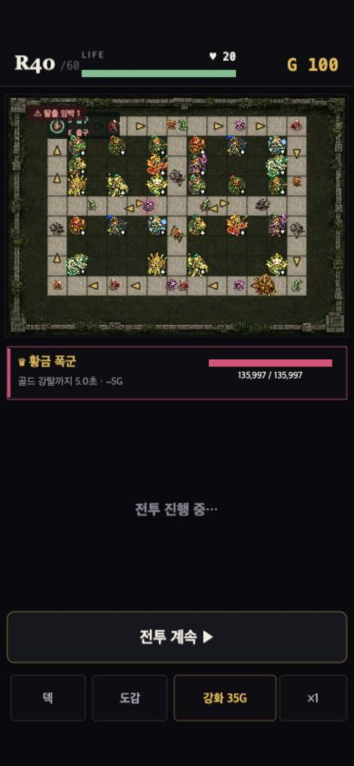
3. Select a unit — P1: large bottom inspector hides pause/continue, global upgrade, speed and other controls while showing disabled preparation actions. Empty space above the actions remains available. Proposed fix: compact combat-only read-only inspector with explicit close; preserve preparation inspector.
   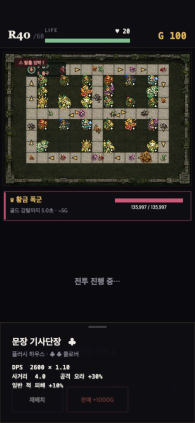
4. Resume combat — sampled attack effects and a damage number remain readable. No effects suppression or numeric aggregation introduced without stronger evidence.
   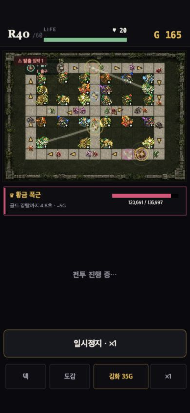

## Evidence limits

All above screenshots captured and opened during this audit. Dense fixture is a reproducible synthetic stress state, not a recorded natural run or difficulty measurement. Screenshot evidence does not establish full accessibility compliance, screen-reader support, sustained performance or all effects combinations. Runtime controls and narrow/English layouts are checked after the targeted fix.

## Acceptance criteria

- Selection must not obscure or intercept combat, upgrade or speed buttons.
- Explicit close must clear selection without touching units behind the control.
- Preparation selling, moving and fusion remain unchanged.
- Boss HP and battlefield boundaries unchanged; compact copy fits narrow Korean/English layouts.
- Core damage, cost, path and difficulty unchanged.

## Status

Targeted fix complete; independent regression and browser verification passed. No version bump, commit or deployment in this task.

## After-fix verification

5. Selected combat unit at 390×844 — healthy: inspector now occupies unused hand space, with explicit close and no inaccessible preparation actions; combat/upgrade/speed rows remain exposed.
   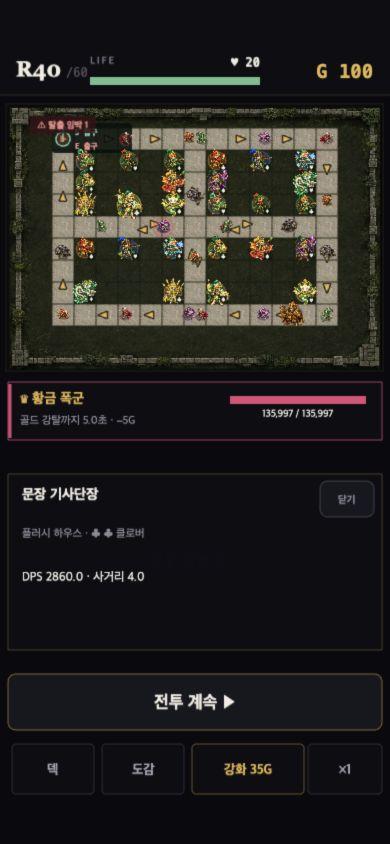
6. Buy upgrade while selected and paused — healthy: gold 100→65, next price 35→41, displayed DPS 2860.0→3088.8, same unit remains selected and game remains paused. Speed x1→x2 also works while selected.
   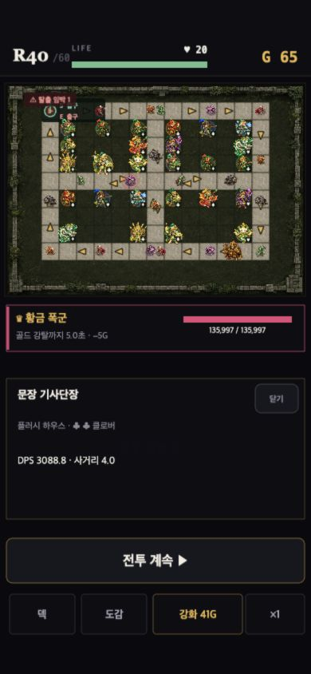
7. English 360×740 — healthy in sampled name/metadata: no overlap. CLOSE removes inspector and selection. Resume→pause round trip keeps selection and returns to RESUME; actual effects are frozen in the screenshot.
   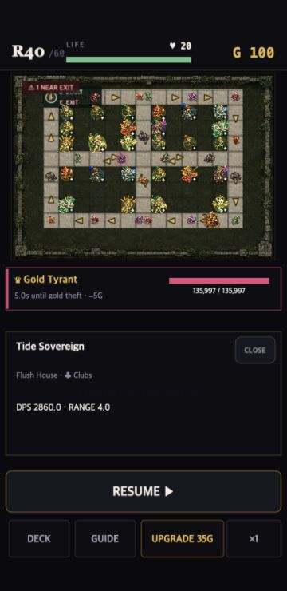
   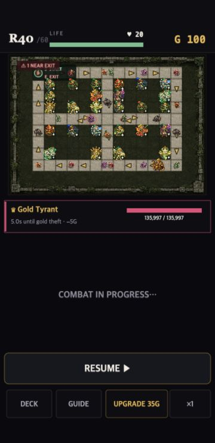
   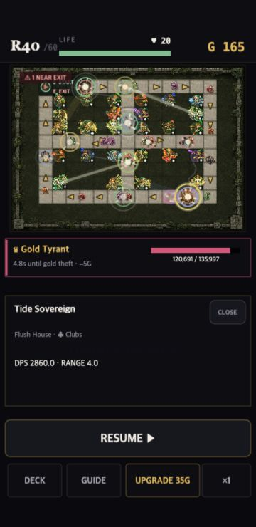
8. Korean 430×932 — healthy: boss panel, inspector and action rows remain separated. Preparation fusion fixture retains its existing sell/move/fusion inspector.
   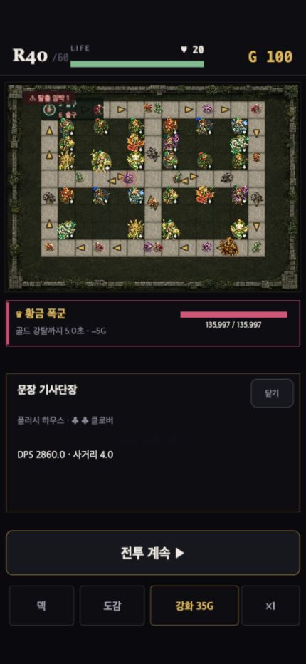
   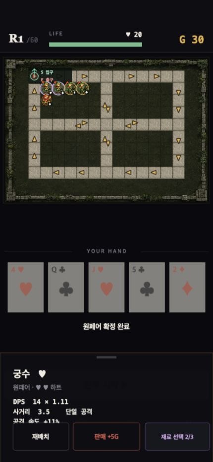

- Independent verification: 51 files / 444 tests, type check, production build and diff check passed.
- Browser console error query returned none.
- No sprites, FX, damage rules, upgrade costs, paths, field dimensions or balancing changed. No claim of full WCAG compliance or full-run/performance coverage.
- Audit-led decision: change only the confirmed inspector obstruction; defer image compression and speculative effects changes.
