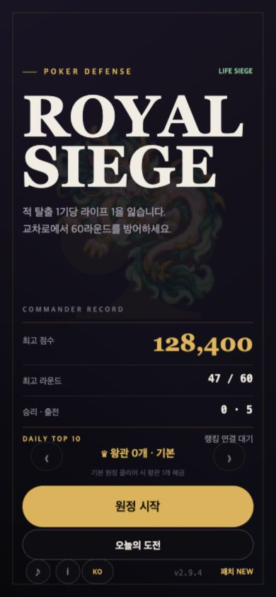
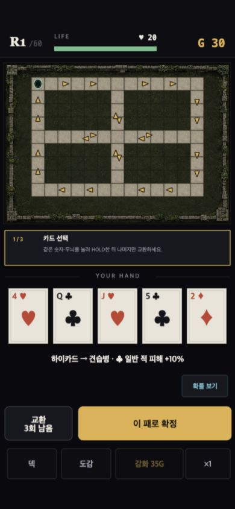
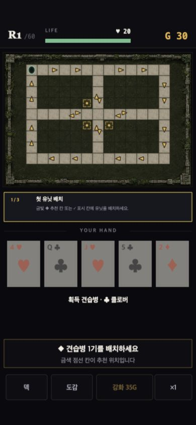
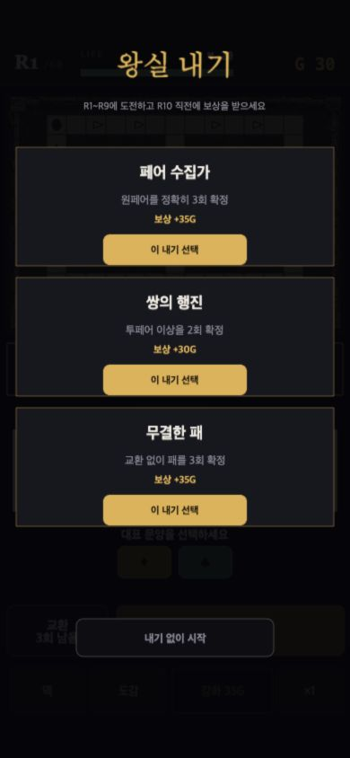
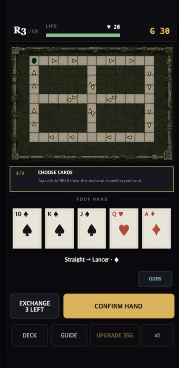
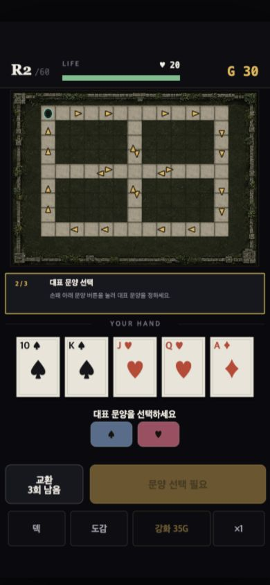
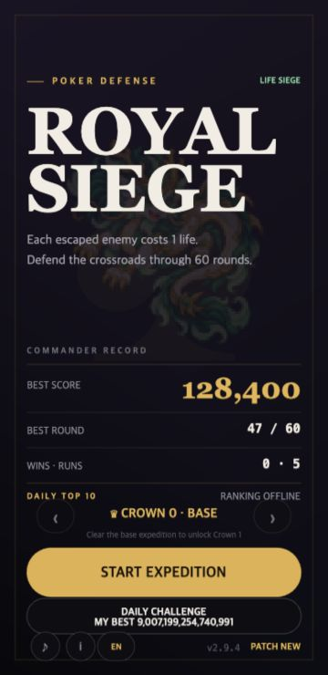
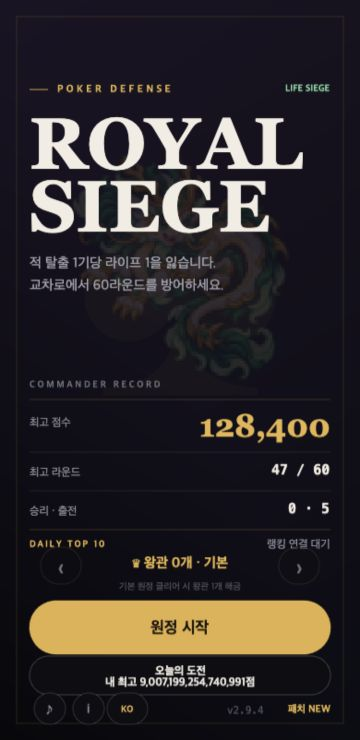

# 첫 경험 점검 — 2026-09-08

390×844, 로컬 게임. 실제 이용자 연구가 아닌 전문가 점검이며 실제 이탈률은 판단하지 않는다.

1. 기존 프로필 메뉴: 주요 시작 버튼 정상. 캡처에 기존 점수/플레이 기록이 있으므로 신규 프로필이라고 주장하지 않는다.
   
2. localhost `mobile-coach` 검증 상태: 첫 실행 카드 안내 표시 정상. 이 fixture는 왕실 내기를 건너뛰므로 전체 신규 진입 순서의 증거로 사용하지 않는다.
   
3. 실제 확정 클릭 뒤 배치 안내 전환 확인. 문구의 체크 표시 설명과 현재 추천 점선 표시 사이 차이 발견. R2/R3 및 문양 동률 상태는 수정 후 추가 검증한다.
   
4. fixture 없는 메뉴→원정 시작: 실제 왕실 내기 선택/건너뛰기 화면 확인. 아직 카드 조작 전 보상/족보 용어를 읽어야 한다. 선택적 부가 목표임을 명확히 하는 것이 1차 변경 범위다. 선택/보상/시점 자체 변경은 아니다.
   

코드 근거: coach.ts R3 우측 BUILD, R2/R3 라운드 우선 안내. PlayScene.ts 일반 retry는 새 시드인데 모바일에 같은 조건 문구. 고칠 구체적 불일치이며, 이것만으로 재방문 향상을 입증하지 않는다.

접근성 한계: 캔버스 기반이므로 스크린샷만으로 스크린리더·전체 키보드 접근성 준수를 주장할 수 없다. 좁은 화면 글자/겹침과 실제 클릭은 별도로 검증한다.

## 수정 후 확인

5. 360×740 영어 `coach-r3`: 실제 클릭으로 가이드 열기/닫기 → 족보 확정 → 추천 타일 배치 → 전투 시작을 확인했다. 안내는 CHOOSE CARDS → PLACE YOUR UNIT → START COMBAT → WATCH THE BATTLE로 바뀌었다. 가이드 모달에는 코치가 끼어들지 않았고 닫은 뒤 복귀했다. 이 캡처와 경로에서 안내 잘림·겹침은 발견하지 못했다.
   
6. 390×844 한국어 `coach-suit`: 대표 문양 동률에서 문양 선택 안내가 먼저 나왔고, 스페이드 버튼을 실제 클릭하자 카드 선택 안내와 확정 가능 상태로 바뀌었다.
   

독립 코드/자동 테스트 검증: 52개 파일 455개 테스트, 타입 검사와 빌드 통과. 코어 수치·시드 규칙 변경 없음. 일반 재시작은 새 원정, 일일 재시작은 같은 일일 도전으로 문구를 맞췄다. 실제 종료 화면 두 모드의 클릭/시각 검증까지 수행했다는 뜻은 아니다. 전체 신규 프로필·전 라운드·실제 사람의 이해도/재방문 향상은 아직 검증하지 않았다.

7. 일일 개인 기록 표시: localhost `daily-best-menu`는 표시용 최대 안전 정수 fixture이며 실제 저장/제출 점수가 아니다. 360×740에서 한/영 두 줄이 기존 버튼 안에 들어감을 확인했다. 한국어 버튼 실제 클릭으로 R1 준비 화면 진입도 확인했다. fixture는 내기 단계를 건너뛰므로 정상 모드의 전체 진입 순서를 증명하지 않는다.
   
   

추가 관측: 브라우저 기본 크기에서 360×740으로 검증 뷰포트를 바꾸는 중 메뉴가 작게 치우친 한 장면을 보았고 고정 크기에서 다시 로드한 뒤 정상화됐다. 실제 기기 회전 이슈와 동일하다고 단정할 수 없으며 화면 회전/크기 전환 회귀는 별도 확인이 남는다. 고정 크기 캡처 통과로 이 한계를 숨기지 않는다.
