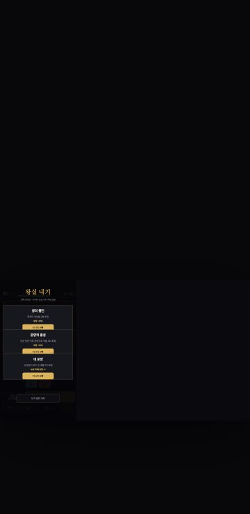
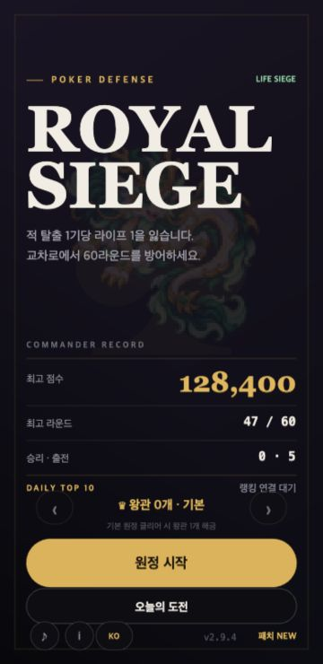
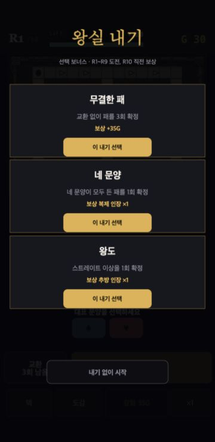
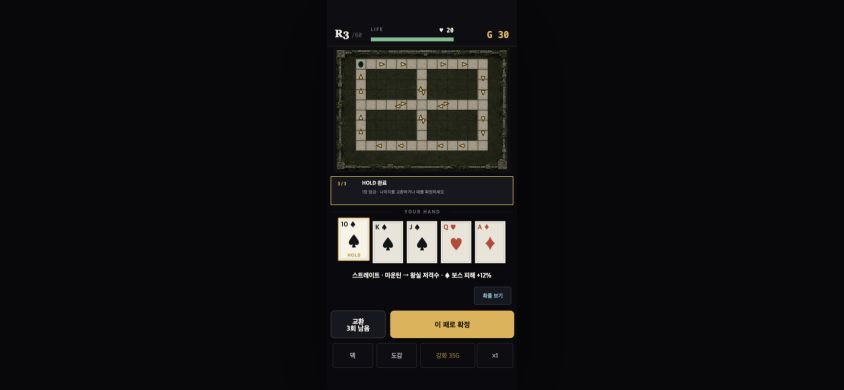

# 화면 크기 전환 안정성

2026-09-08 로컬 CUA 재현. 이전 목표 턴은 초반 안내/일일 기록/측정 도구 구현과 검증이 남은 진척이었다. 이번에는 미해결로 기록한 크기 전환 문제를 독립 재현했다.

## 수정 전 증거

1. 1280×720 기본 브라우저에서 메뉴 로드.
2. 새로고침 없이 360×740으로 viewport 전환.
3. 작은 가로 메뉴의 원정 시작 버튼 실제 클릭.
4. 왕실 내기 화면이 논리 캔버스 왼쪽 작은 영역에 그려짐.

원인: boot에서 캔버스 규격은 고정되지만 UI의 isPortraitLayout은 현재 window 비율을 재판정한다. 다른 좌표 기준이 한 화면에 섞인다. 실제 휴대폰 하드웨어의 회전 검증을 대신한다고 주장하지 않는다.

## 승인한 수정 기준

활성 원정은 논리 레이아웃을 유지하고 등비로 맞춘다. 회전 때문에 손패/적/골드/배속/일시정지를 초기화하거나 scene을 재시작하지 않는다. 새로 여는 모달도 현재 캔버스 좌표를 쓴다. 메뉴는 진입 또는 모달 없는 안전한 시점에 크기를 일괄 반영한다. 입력 중인 랭킹/동의 창은 닫거나 제출하지 않고, 선택 왕관과 분석 이벤트를 보존한다. 리스너는 종료 시 정리한다.

상태: 로컬 구현·독립 재검증 완료. 활성 원정의 방향별 최적화 대신 진행 보존을 우선하며 여백은 허용한다. 전장/경로/난도/배포 변경은 범위 밖이다.

## 수정 후 검증

- 같은 1280×720→360×740 메뉴 전환과 원정 시작 클릭에서 메뉴/왕실 내기가 정상 크기로 표시됐다.
  
  
- 개발 서버 파일 저장 중 원정이 메뉴로 돌아온 장면은 자동 재로딩 가능성이 있어 확정 증거로 쓰지 않았다. 자동 재로딩 없는 `vite preview` 4174 포트로 다시 검증했다.
- R3 localhost fixture에서 10스페이드 HOLD→844×390 전환→도감 열기/닫기→360×740 복귀→확정→배치→전투→일시정지→회전 흐름을 실제 클릭했다. 손패·HOLD·라운드·골드와 전투 일시정지가 유지됐다.
- 추가로 CSS flex와 Phaser CENTER_BOTH의 이중 중앙 정렬 때문에 오른쪽으로 치우치는 현상을 발견했다. Phaser NO_CENTER로 단일화하고 최종 빌드에서 동일 HOLD·회전을 재확인했다.
  
- 동의 창은 선택 변경 없이 열린 상태의 크기 전환 유지까지만 확인했다. 패치 노트는 열림→크기 전환→실제 닫기 클릭→모바일 메뉴 재배치를 확인했다.
  
- 최종 독립 검증: 55개 파일 469개 테스트, 타입 검사·프로덕션 빌드·diff 검사 통과. core 수치 변경 없음.

한계: 실제 휴대폰 OS 회전·키보드·노치별 실기기 조합, 원격 랭킹 이름 제출 중 회전은 실행하지 않았다. 동의 선택·외부 제출을 검증 목적으로 바꾸지 않았다. 분석 중복/왕관 유지/리스너 정리는 코드와 자동 테스트 근거다. 고정 레이아웃은 회전 시 여백과 작은 화면을 허용하며 방향별 재설계 완료라는 뜻이 아니다.
